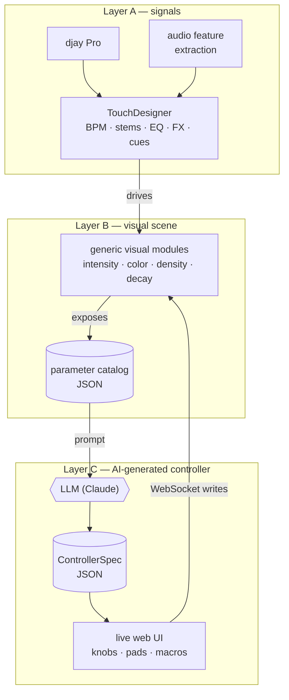

# Unicorner

**AI reads your visual scene and gives you a controller to play it.**

A hackathon prototype from the [Music Hackspace Lisbon hackathon](https://musichackspace.org/events/hackathon-lisbon-spring-2026) (16–17 May 2026, Algoriddim track).

> "If you DJ at a club with a screen, you have nothing to put on it. This makes it easy."
> — Richie Hawtin, after the demo

Most "AI generates a UI" work treats the UI as the output. Unicorner treats the UI as the side effect. The interesting work is **reading the scene** — walking the parameter catalog of a TouchDesigner project, inferring what each control does musically and visually, and surfacing a small, opinionated, playable subset for the iPad. Optional routings wire [djay Pro](https://www.algoriddim.com/) signals (BPM-locked LFOs, beat envelopes, bass-driven modulation) directly into the scene.

## What it does

- **Reads any TouchDesigner scene** — walks the parameter tree of marked Layer B modules + curated built-ins, builds a catalog of every modulatable param with semantic hints.
- **Chats with the DJ** — multi-turn per scene. "Make me a beat-reactive intensity control." Ambiguous prompts come back as 2–3 substantively different alternatives or a clarifying question.
- **Generates a playable iPad surface** — knobs, toggles, macros, with curves shaped for live play. Knob moves write straight back to the TD param over WebSocket.
- **Wires music into the scene** — optional routings drive scene params from djay signals: direct mappings, BPM-locked LFOs, beat envelopes, bar resets.
- **Learns your physical controller** — MIDI learn modal binds hardware knobs to rendered widgets.

## How it works

Three layers. The music flows down the left spine (A → B → visuals). The unique part is the loop on the right: Layer B publishes a machine-readable parameter catalog, an LLM turns it into a controller spec, and the rendered UI writes back into the same visual modules over WebSocket. Swap the scene → new catalog → AI regenerates the controller.

No Node bridge. No MCP at runtime. No `pip install`. The generator calls Anthropic directly from TouchDesigner's bundled Python; everything is bundled in a single `.tox`.

## Try it

1. Open TouchDesigner. Drag `td/unicorner_controller.tox` onto your project.
2. Set the `Apikey` parameter on the COMP (or `ANTHROPIC_API_KEY` env var, or `td/.unicorner_config.json`).
3. Open `http://localhost:9980` on an iPad on the same network.
4. Open the ⚙ Designer drawer → "🔍 Scan scene" → chat a prompt → controls appear.

Releases ship a zipped `.tox` + built controller dist on every push to `main`. See [`.github/workflows/release.yml`](.github/workflows/release.yml).

For local UI work: `cd controller && npm run dev`.

## Status

Hackathon prototype, not actively maintained.

- **Full writeup** — what shipped, the pivots, the demo story, Richie + judge feedback, where this could go next: [HACKATHON.md](HACKATHON.md)
- **Original plan** (pre-build, kept as historical artifact): [PLAN-original.md](PLAN-original.md)
- **TD-side dev notes + gotchas**: [CLAUDE.md](CLAUDE.md)

## Team

| Person | Workstream |
|---|---|
| Dan | Layer C: AI scene reader + controller generator + iPad renderer |
| Calin | Layer A integration + Layer B visual modules |
| Bernardo | Visual identity (with Calin) + controller UX (with Dan) |
| Guille | Audio signal extraction (Layer A augmentation) |
| Eugene | QA, integration testing, music selection |
