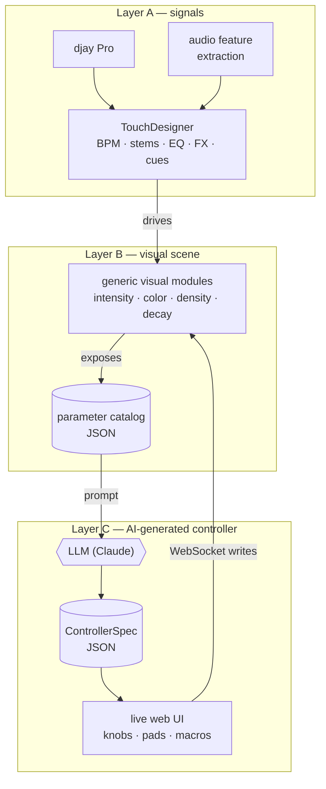

# Unicorner

**AI builds the visual instrument.**

A hackathon project for the [Music Hackspace Lisbon hackathon](https://musichackspace.org/events/hackathon-lisbon-spring-2026) (16–17 May 2026), Algoriddim track.

Most teams will spend the weekend hand-crafting a single cool visual. We're building the *tooling layer* that turns any visual scene into an opinionated, playable instrument — automatically — so a DJ can perform visuals without thinking and without setup work.

## The idea

A DJ playing in [djay Pro](https://www.algoriddim.com/) gets a small, well-designed control surface (knobs, toggles, pads) that is **generated by AI** from whatever visual scene is loaded in TouchDesigner.

- Swap the visual scene → AI regenerates a new controller in seconds
- Plug in a different MIDI controller → AI generates a new mapping
- The expressive layer adapts; the DJ doesn't

The DJ never has to think about visuals as a second instrument — they just play.

## How it works

Three layers. The music flows down the left spine (A → B → visuals). The unique part is the loop on the right: Layer B publishes a machine-readable parameter catalog, an LLM turns it into a controller spec, and the rendered UI writes back into the same visual modules over WebSocket. Swap the scene → new catalog → AI regenerates the controller.



## Versions

- **v1** (ship in 2 days): AI-generated software controller, scene swap regenerates it live
- **v2**: bring-your-own physical MIDI controller — AI auto-maps it
- **v3**: autopilot — AI plays the controller for you, driven by the music
- **v4**: background MCP-driven agent that reconfigures TouchDesigner itself

## Team

| Person | Workstream |
|---|---|
| Dan | Layer C: AI controller generator + UI renderer + OSC return |
| Calin | Layer A integration + Layer B visual modules |
| Bernardo | Visual identity (with Calin) + controller UX (with Dan) |
| Guille | Audio signal extraction (Layer A augmentation) |
| Eugene | QA, integration testing, music selection |
| Alex | DJ for the live demo |

## Running the controller locally

There are two workflows depending on what you're testing.

**Hot-reload — for UI work (no TouchDesigner needed)**

```bash
cd controller && npm run dev
```

Opens at `http://localhost:5173`. Use this URL in your browser or on an iPad on the same network. WebSocket messages won't reach TD unless TD is also running, but the UI renders fine for layout and styling work.

**TD-served — to test the full WebSocket flow**

```bash
./scripts/sync-dist.sh
```

This builds the React app and syncs the output to `td/unicorner_controller_dist/`, which is where the COMP looks by default. Then in TouchDesigner, pulse the `Refreshurl` parameter on the `unicorner_controller` COMP to reload. Open `http://localhost:9980` — you should see the controller UI, not the "web server is up" message.

> If the COMP's `Distpath` parameter was set to a custom path, it must point to a folder that contains `index.html`. The default `./unicorner_controller_dist` (relative to the `.toe`) is what `sync-dist.sh` targets.

## More

Full plan (architecture, schemas, milestones, risks) in [`PLAN.md`](./PLAN.md).
